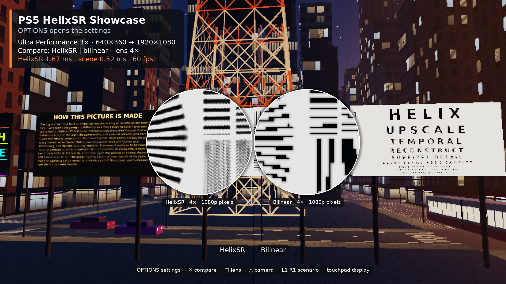
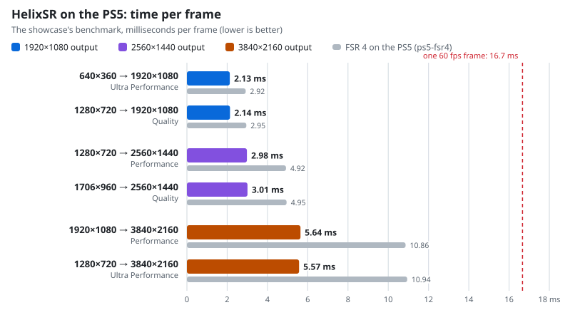

# PS5 HelixSR

*The [showcase app](examples/helixsr_showcase/README.md) on a PS5, upscaling
640×360 to 1920×1080 at 60 fps. Both lenses magnify the same spot of a
resolution chart four times: HelixSR on the left, a bilinear upscale of the same
frame on the right.*

> [!WARNING]
> **Experimental, source only: you bring NVIDIA's DLSS DLL.** HelixSR runs
> natively on the PS5 and passes its acceptance against the original HelixSR in
> every scenario, at 1080p, 1440p and 4K. The network it runs is NVIDIA's, so
> this repository holds no weights and no kernels and publishes no binaries.
> You build it yourself: the build makes the network's two files on your
> machine from NVIDIA's own `nvngx_dlss.dll`, as HelixSR does
> ([how to build](BUILDING.md)). The runtime needs a diagnostic profile of the
> Vulkan driver.

> [!IMPORTANT]
> **HelixSR is the work of [lonewolf0622](https://github.com/lonewolf0622/HelixSR)**:
> the translation of NVIDIA's network kernels to compute shaders, the host model
> that plans them and the arithmetic that makes them fast on AMD hardware. This
> project is built on the setup components HelixSR 1.2.0 publishes.
> **NVIDIA created DLSS and the Model E network.** BlackBearReloaded's
> contribution here is the native PS5 adaptation, integration and validation.
> See [full credits and provenance](THIRD_PARTY_NOTICES.md#helixsr-and-dlss-credits).

A **native PS5 runtime for HelixSR**: NVIDIA's DLSS Model E network running on
Vulkan compute, for PS5 homebrew. The Vulkan driver is the
[`external/ps5-vulkan`](external/ps5-vulkan) submodule: BlackBearReloaded's fork
of [Manuel Pereira's ps5-vulkan](https://github.com/mpereiraesaa/ps5-vulkan).
It is the sibling of [ps5-fsr4](https://github.com/blackbearreloaded/ps5-fsr4),
with the same showcase app, so the two upscalers can be set side by side.

**Status:** Experimental.

- The `ps5_helixsr` runtime upscales 1280×720 to 1920×1080 on the PS5 in
  2.1 ms per frame, and to 3840×2160 in 5.6 ms ([performance](#performance)).
- Every ratio from native anti-aliasing (1×) to Ultra Performance (3×) runs the
  main network, as HelixSR does by default, with or without automatic exposure.
- Its output is checked against the original: the HelixSR 1.2.0 DLL itself,
  run on Windows' software renderer with the same inputs. At 1920×1080 the PS5
  is 64 to 67 dB from the original, as close as the same runtime on a desktop
  driver, and 70 dB from that driver's own output. All 24 scenarios are
  accepted ([validation](VALIDATION.md)).
- The [showcase app](examples/helixsr_showcase/README.md) (PPSA99013) draws a
  city at dusk and upscales it at 60 fps. Its settings choose every quality
  mode at 1080p, 1440p and 4K output, with split views against bilinear and
  native rendering, a paired magnifier and a benchmark of the upscaler.
- One C header, `include/ps5helixsr/ps5_helixsr.h`: a context per render and
  output size, and a dispatch that records into the application's command
  buffer ([the runtime](docs/SDK.md)).

## Performance

<picture>
  <source media="(prefers-color-scheme: dark)" srcset="docs/perf/cases-dark.svg">
  
</picture>

| Render → output | Mode | Time per frame | Share of a 60 fps frame | FSR 4 on the PS5 |
| --- | --- | ---: | ---: | ---: |
| 640×360 → 1920×1080 | Ultra Performance | 2.13 ms | 13% | 2.92 ms |
| 1280×720 → 1920×1080 | Quality | 2.14 ms | 13% | 2.95 ms |
| 1280×720 → 2560×1440 | Performance | 2.98 ms | 18% | 4.92 ms |
| 1706×960 → 2560×1440 | Quality | 3.01 ms | 18% | 4.95 ms |
| 1920×1080 → 3840×2160 | Performance | 5.64 ms | 34% | 10.86 ms |
| 1280×720 → 3840×2160 | Ultra Performance | 5.57 ms | 33% | 10.94 ms |

These times come from the benchmark of the
[showcase app](examples/helixsr_showcase/README.md), with automatic exposure:
it submits 300 frames back to back and times each from submission to completion
on the GPU. Running at 60 fps the app measures about the same at 1080p and
1440p, and 5.4 ms at 4K. *Benchmark the six scenarios* in its settings times
each case on any console and shows it beside this table. The last column is
[ps5-fsr4](https://github.com/blackbearreloaded/ps5-fsr4#performance)'s own
table, measured the same way by its headless benchmark.

The early convolutions multiply and add in two operations, so that the console
computes the same bits as the reference does. Fused into one operation they
are a fifth faster (1.69 ms at 1080p, 4.80 ms at 4K) and the output moves by
one part in 3,500 (71 dB): `HELIXSR_CONV_FUSED=1 make shaders` builds that
form ([the early stages](docs/EARLY_STAGES.md)).

The first context on a console compiles the network's shaders, which takes 36
seconds; with the pipeline cache it then saves, a context is made in 50 ms.

`tools/build_perf_charts.py` draws the chart from the measurements recorded in
it.

## How it works

HelixSR's setup reads two things out of NVIDIA's DLSS DLL: the weights of the
Model E network and the CUDA kernels that evaluate it, as PTX. It translates
the kernels to HLSL and plans every launch of a frame with a host model of the
network. This project takes it from there:

- **The kernels** go through HelixSR's translator, are adapted to Vulkan and
  compiled to SPIR-V with DXC. They are CUDA kernels still: blocks of 32-thread
  warps whose threads exchange values, which the PS5's 32-lane waves match.
- **The four early convolution stages** hold nearly all of the network's
  arithmetic. They are written here for the console GPU
  (`tools/conv_kernels.py`): lanes are neighbouring pixels, so a weight is the
  same for a whole wave and is read once through the scalar path, and each
  product is a packed FP16 multiply and add on two output channels.
- **The runtime** (`src/`) turns the host model's plan into a fixed set of
  pipelines, descriptors and constants, owns the tensors and the history, and
  records a frame as 18 compute dispatches.
- **The reference** is the original DLL, run with the same inputs on WARP; a
  frame runner replays those inputs on the console and on a desktop driver
  ([validation](VALIDATION.md)).

## Layout

| Path | Contents |
| --- | --- |
| `include/ps5helixsr/` | Public C API |
| `src/` | Runtime: context, dispatch, the plan of a frame |
| `shaders/` | The E5M3 encoder, and the exact convolution stages the tests compare with the PTX |
| `tools/` | Shader generators, builders, the reference runner, comparison and acceptance |
| `tests/` | Host tests |
| `samples/` | The frame runner |
| `examples/helixsr_showcase/` | The showcase app |
| `third_party/helixsr/` | HelixSR's host model and tables, unmodified |
| `validation/` | The pinned identities of the generated shaders and of the plan |
| `patches/` | The 32-lane change to Mesa's lavapipe that host runs need |
| `docs/` | The runtime guide, the early convolution stages, the performance chart |
| `external/ps5-vulkan/` | The Vulkan driver (submodule) |

Clone with `git clone --recurse-submodules`, or let `make` fetch the driver, then
follow [BUILDING.md](BUILDING.md).

## Development

- [Build instructions](BUILDING.md)
- [The runtime](docs/SDK.md)
- [Validation](VALIDATION.md)
- [Showcase app](examples/helixsr_showcase/README.md)
- [The early convolution stages](docs/EARLY_STAGES.md)
- [Vulkan driver API](external/ps5-vulkan/API.md)

Keep test captures, logs and detailed results local, and never commit, attach
or share anything made from NVIDIA's DLL: the weights, the kernels, a pipeline
cache, or a title folder that holds them.

<!-- bbr-footer:start -->
<!-- Generated by ps5-homebrew-dev-protocol/scripts/readme-footer. Edit the template there, not here. -->

## Credits

Built with the [PS5 Payload SDK](https://github.com/ps5-payload-dev/sdk) by John Törnblom (ps5-payload-dev).
Third-party components, authors and licenses are listed in
[THIRD_PARTY_NOTICES.md](THIRD_PARTY_NOTICES.md).

## License

Copyright © 2026 BlackBearReloaded. Licensed under GPL-3.0-or-later; see [LICENSE](LICENSE). Third-party components keep their own licenses.

## Disclaimer

- **No affiliation.** This is an independent homebrew project. It is not
  affiliated with, endorsed by, or sponsored by Sony Interactive Entertainment.
  "PlayStation", "PS5" and related marks are trademarks of Sony Interactive
  Entertainment Inc. NVIDIA and DLSS are trademarks of NVIDIA Corporation. AMD, FidelityFX and FSR are trademarks of Advanced Micro Devices, Inc. Neither company endorses this project.
- **No proprietary material.** No Sony SDK, firmware, encryption keys or
  decrypted system modules are included.
- **No warranty.** This project is provided "as is", without warranty of any
  kind, to the extent permitted by law. See sections 15 and 16 of the GPL.
- **Use at your own risk.** Running homebrew requires a modified console, which
  may void its warranty, breach the platform's terms of service, or cause data
  loss.
- **Legal use only.** Use it only with hardware, accounts and content you own.
  This project does not support or enable piracy.

## AI assistance

This project was developed with AI assistance from OpenAI and/or Anthropic tools.
<!-- bbr-footer:end -->
