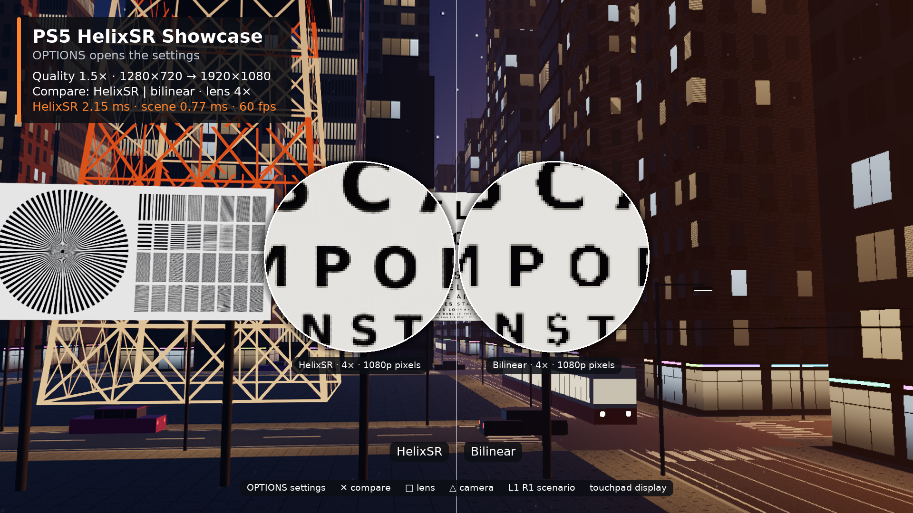
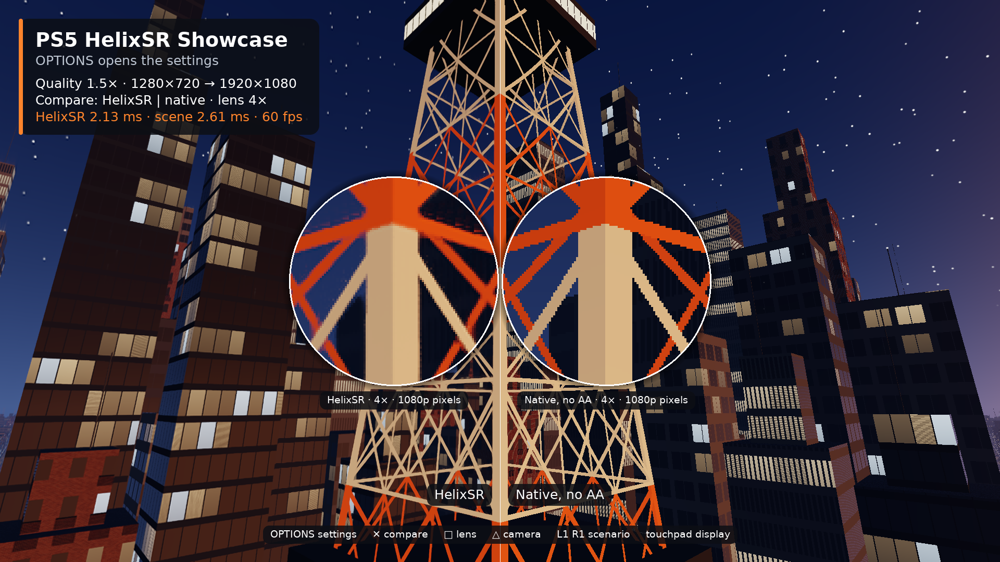
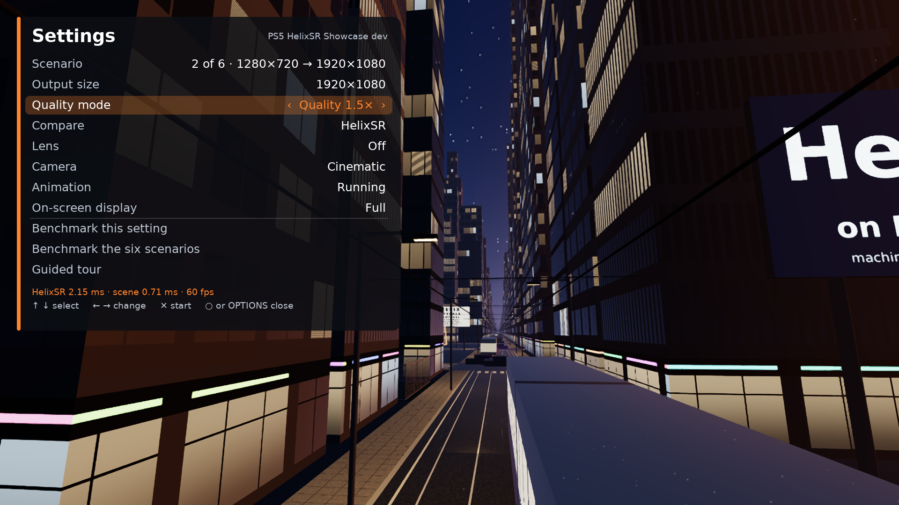
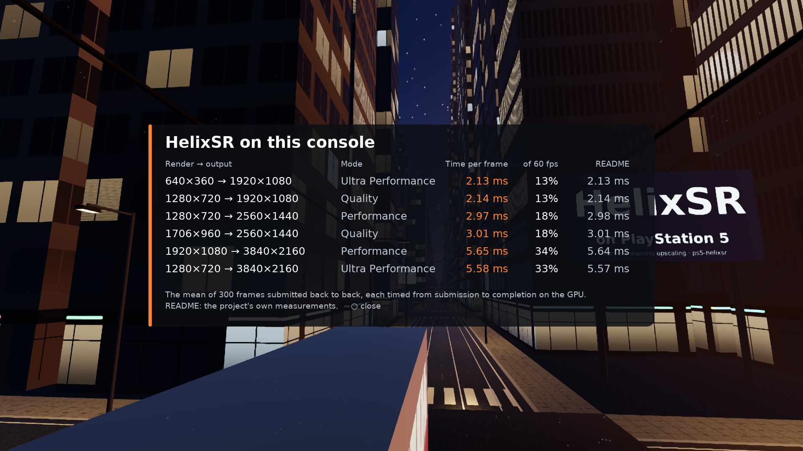
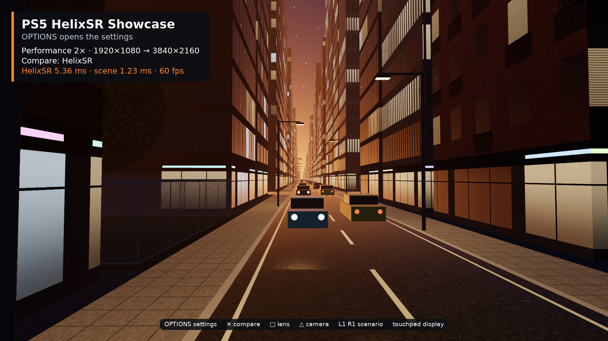

# PS5 HelixSR Showcase


A native PS5 app, packaged as its own title (**PPSA99013**, *PS5 HelixSR
Showcase*), that shows what the `ps5_helixsr` runtime does on the console. It
draws a city at dusk at a fraction of the output size, upscales it with HelixSR
and presents it at 60 fps. A settings menu changes the render and output sizes,
compares HelixSR with a bilinear upscale and with native rendering, and measures
the upscaler on the console it runs on.

It is the [PS5 FSR4 Showcase](https://github.com/blackbearreloaded/ps5-fsr4/tree/main/examples/fsr4_showcase)
with the upscaler replaced: the same scene, camera shots, menu and benchmark,
so the two can be set side by side. What FSR 4 has and HelixSR has not, RCAS
sharpening and a render size that changes every frame, is gone from the menu.

| | |
| --- | --- |
|  |  |
| *HelixSR and bilinear, both from 1280×720, lens 4×* | *HelixSR from 1280×720 and native 1920×1080 without anti-aliasing* |
|  |  |
| *The settings* | *The benchmark of the six scenarios* |
|  | |
| *Performance 2×: 1920×1080 → 3840×2160 in 5.4 ms at 60 fps* | |

All of them are frames of the app's self-test on a PS5, saved from the buffer
it presents.

## The network is not in the app

HelixSR runs NVIDIA's DLSS Model E network, and both its weights and its
kernels are NVIDIA's. The app is built without them and reads two files:

| File | What it is | Made by |
| --- | --- | --- |
| `model.bin` | the weights (1.9 MB) | `make model`: HelixSR's own setup, from your `nvngx_dlss.dll` |
| `kernels.bin` | the network's compute shaders (5.9 MB) | `make shaders`, packed by `make network-files` |

`make network-files` leaves both in `build/network-files`
([BUILDING.md](../../BUILDING.md)). The app looks for them in its `assets`
folder first, then in the folder it writes its log to. It accepts only the
kernels this revision pins. Without the files, or with files of another
revision, it says so on screen and shows the bilinear upscale alone.

`--model FILE` and `--kernels FILE` put the files into the title folder at
build time. A folder that holds them is for your own console: do not pass it
on. The folder without them contains nothing of NVIDIA's.

## The scene

The city is built from what an upscaler finds hard, and nothing in it is
filtered: every render pixel is one sample, as in a game without anti-aliasing.

- **Thinner than a pixel:** tram wires 3 cm thick, strings of lights across the
  streets, antennas, lamp posts, a chain-link fence around each park and the
  leaves of its tree.
- **A lattice tower** 144 m tall, made of girders, braces and posts, and a
  **big wheel** with spokes, stays and lights.
- **Fine regular patterns:** louvred facades, brick with mortar lines, balcony
  bars, window mullions, pavement joints and zebra crossings.
- **Text and a resolution chart** on billboards in an open square: a reading
  chart whose rows get smaller, a page of small print, neon signs, and a chart
  with a star of 72 spokes and line pairs from 16 cm down to a millimetre.
- **Motion:** two tram lines, traffic with head and tail lights, the turning
  wheel and its gondolas, a blinking beacon. Each writes its own motion vectors.

`city.comp` casts one ray per pixel in a compute shader: across the street plan
cell by cell, and against the landmarks. It writes what the runtime takes:
linear HDR color, inverted depth and motion vectors in render pixels.

## Settings

OPTIONS opens the menu. The D-pad selects a row and changes its value.

| Row | Values |
| --- | --- |
| Scenario | The six render and output sizes of the [performance table](../../README.md#performance), or *Custom* |
| Output size | 1920×1080, 2560×1440, 3840×2160 |
| Quality mode | Native AA (1×), Quality (1.5×), Balanced (1.7×), Performance (2×), Ultra Performance (3×) |
| Compare | HelixSR; HelixSR split against bilinear or against native rendering; bilinear; native |
| Lens | Off, or 2× to 8×: a magnifier on the output's own pixels, paired in a split view |
| Camera | Cinematic (eight shots through the city) or free flight |
| Animation | Running or paused |
| On-screen display | Full, compact or off |
| Benchmark this setting | Times HelixSR at the current sizes |
| Benchmark the six scenarios | Times all six and shows them beside the README's numbers |
| Guided tour | Ten chapters, about two minutes |

The display is 1920×1080. A larger output is box-filtered down to it, so the
whole frame is supersampled, and the lens shows the output's own pixels.
A HelixSR context is made for one render size and one output size, so changing
either makes a new one, which takes about 50 ms. A native view at 3840×2160
renders the scene a second time at that size.

## Controls

| Input | Action |
| --- | --- |
| OPTIONS | Settings |
| Cross | Next comparison |
| Square | Lens on or off |
| Triangle | Cinematic camera or free flight |
| L1 / R1 | Previous or next scenario |
| Touchpad | On-screen display: full, compact, off |
| D-pad | Move the lens, or the divider of a split view |
| Left stick | Free flight: move |
| Right stick | Free flight: look |
| L2 / R2 | Free flight: down and up |

The app starts with the guided tour. Any button ends it, and it starts again
after a minute without input.

## The first start

The first time, the upscaler's shaders are compiled for the console, which
takes about 36 seconds; the app shows a frame that says so. It then saves them
as `pipeline-cache.bin` next to its log, and later starts make the context in
50 ms. A new build of the app or of the driver compiles again.

## Performance on PS5

The six scenarios, measured by the `--selftest` build on a PS5 with system
software 13. *Benchmark* is what the app's own benchmark reports: the mean of
300 HelixSR frames submitted back to back, each timed from submission to
completion on the GPU. *In the app* is the same measurement at the 60 fps the
app runs at.

| Render → output | Mode | Benchmark (ms) | In the app (ms) | Scene (ms) | Frame rate |
| --- | --- | ---: | ---: | ---: | ---: |
| 640×360 → 1920×1080 | Ultra Performance | 2.13 | 2.10 | 0.7 | 60 |
| 1280×720 → 1920×1080 | Quality | 2.14 | 2.15 | 0.8 | 60 |
| 1280×720 → 2560×1440 | Performance | 2.98 | 2.95 | 1.0 | 60 |
| 1706×960 → 2560×1440 | Quality | 3.01 | 2.98 | 4.8 | 60 |
| 1920×1080 → 3840×2160 | Performance | 5.64 | 5.36 | 1.3 | 60 |
| 1280×720 → 3840×2160 | Ultra Performance | 5.57 | 5.31 | 0.9 | 60 |

HelixSR's cost follows the output size: most of the network runs at a fraction
of the output resolution, and its last stage at the output's. The scene costs
between 0.4 and 5 ms, depending on the shot and the render size; the view over
the roofs is the most expensive. Composing the display frame adds 1.5 to
1.7 ms.

## What was run

On a PS5 (system software 13):

- the `--selftest` build, which walks the six scenarios, the comparisons, the
  menu and the benchmark and saves a frame of each;
- the regular build, whose guided tour ran at 60 fps (16.65 ms a frame,
  HelixSR 2.14 ms) from a warm start;
- a `--keys` build, which plays button presses through the code the pad
  feeds: the quick keys (compare, lens, lens position, camera, scenario,
  on-screen display), every row of the menu in both directions, closing and
  reopening it, and *Benchmark the six scenarios* to its results. The pad
  itself was open and read with a controller connected. That run found that
  Ultra Performance at 2560×1440 (853×480, a truncated third) was refused by
  the runtime; it is accepted now.

On the host: the same walk and the same key scripts through `SHOWCASE_KEYS`.
The free camera was flown the same way: the left stick's four directions, the
right stick's, and both triggers. What no script can do is look: a person's
eye on a television has not been part of any run.

## System software

| System software | Result |
| --- | --- |
| 13.x | 60 fps in every scenario; the numbers above |
| 10.x | About 27 fps in every scenario (two display refreshes a frame); the benchmark's numbers are not valid there |

System software 10 completes a GPU submission only at the next display
refresh. The app, like the FSR4 showcase, probes for that when it starts, with
a few tiny dispatches, and then sends the whole frame as one submission. On
the one console with system software 10 where the self-test ran, the probe
came back in 1.2 ms and missed it, so the app kept its three submissions a
frame, each took 16.4 ms, and it ran at 14 fps.

The app therefore also watches its own frames: composing the display frame
takes under 2 ms, so when it takes more than 12 ms eight frames in a row the
submissions are waiting for the display, and the app switches to one
submission a frame and logs it. On system software 13 this never triggers
(checked). On system software 10 it triggered at the seventh frame of the
self-test, and the frame went from 70 ms to 35 to 41 ms; the owner saw 24 to
30 fps on the television. That is the same two-refresh limit the FSR4 showcase
has there. The benchmark reads 16.48 ms in every scenario on that system
software, because it measures the wait for the display, not the network.
Everything else worked: the shaders compiled (36 s the first time), every
scenario and context ran, the pad was read, and the app left by itself.
A second launch read the saved pipeline cache and built its first context in
0.1 s, with the same frame times.

If the GPU fails, the app writes the failing stage to its log and returns to
the home screen.

## Build and install

Build the driver SDK and the shaders first ([BUILDING.md](../../BUILDING.md)),
then:

```sh
make network-files
make showcase SHOWCASE_ARGS="--model build/network-files/model.bin --kernels build/network-files/kernels.bin"
```

This builds `build/showcase/PPSA99013`. Upload the `PPSA99013` folder to
`/data/homebrew/` on a PS5 running a homebrew loader with ShadowMountPlus, and
start **PS5 HelixSR Showcase** from the home screen once it is registered. The
app runs until it is closed. It writes `helixsr-showcase-log.txt` to its own
`results` folder with `HELIXSR_SHOWCASE_*` lines: setup, chapters, benchmark
results and averaged timings every 120 frames.

`SHOWCASE_ARGS` passes options to `tools/build_showcase.py`:

- `--model FILE` and `--kernels FILE` put the two files into the folder's
  `assets`. Without them, copy `model.bin` and `kernels.bin` to
  `PPSA99013/assets/` on the console yourself.
- `--selftest` replaces the controller with a scripted walk: the six scenarios,
  the comparisons, the menu and the benchmark. It logs one
  `HELIXSR_SHOWCASE_STEP` line with averaged timings and saves one 1920×1080
  BGRA frame per step (`helixsr-showcase-NAME.bgra`, next to the log), then
  ends with `HELIXSR_SHOWCASE_SELFTEST_DONE` and closes the title.
- `--keys LETTERS` plays button presses instead of the pad, one every four
  frames, logs the app's state before each (`HELIXSR_SHOWCASE_KEY`), saves the
  last frame and closes the title. The letters are those of `SHOWCASE_KEYS`
  below.
- `--version VERSION` sets the version the settings panel shows.
- `--host` builds `build/helixsr_showcase` instead: the same app for desktop
  Vulkan, without a display or a controller.

## Host preview

The host build runs the scripted walk off-screen and saves its frames. It needs
the host build of the runtime (`make host`) and a Vulkan driver with 32-lane
subgroups ([BUILDING.md](../../BUILDING.md#running-on-the-host)); the patched
lavapipe upscales a 1080p frame in a second and a half.

```sh
make showcase SHOWCASE_ARGS="--host --model build/network-files/model.bin"
cd build/showcase-host && mkdir -p frames
SHOWCASE_STEPS=1,6 SHOWCASE_STEP_FRAMES=24 ../helixsr_showcase   # frames/helixsr-showcase-NAME.bgra
SHOWCASE_KEYS=oddrx ../helixsr_showcase                           # button presses instead of the walk
```

`SHOWCASE_STEPS` picks steps of the walk by number and `SHOWCASE_STEP_FRAMES`
sets how long each runs. `SHOWCASE_KEYS` plays one button every four frames
(`o` OPTIONS, `u d l r` the D-pad, `x` Cross, `c` Circle, `s` Square,
`t` Triangle, `1` L1, `2` R1, `p` Touchpad, `.` nothing; `w z a e` the left
stick, `i m j k` the right stick, `n v` L2 and R2, each held for its four
frames) and saves the last frame as `helixsr-showcase-keys.bgra`.

## Launch assets

`sce_sys/` holds the app's own icon and backgrounds, by BlackBearReloaded:
`icon0.png` (512×512 PNG), `pic0.dds` (home screen background) and `pic1.dds`
(the picture shown while the app starts), both 3840×2160 BC7 DDS with a DX10
header. The selection music is the FSR4 showcase's.

The HUD and the signs use DejaVu Sans, rasterized at build time from the system
font (`fonts-dejavu-core`) under the Bitstream Vera license.
